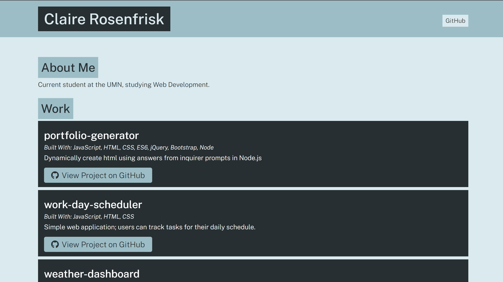

# portfolio-generator
Create styled portfolio dynamically using inquirer prompts in Node.js.

## Table of Contents

* [Description](#Description)
* [Process](#Process) 
* [Challenges](#Challenges)
* [View the Project](#View-The-Project)
* [Installation and Use](#Installation-and-Use)
* [Technologies Used](#Technologies-Used) 
* [Credits](Credits)
* [MIT License](#MIT-License)

## Description

This application was designed for anyone who uses GitHub and would like to create a portfolio dynamically using `Node.js`. 

## Process

Capture user input initially by using `var profileDataArgs = process.argv.slice(2, process.argv.length);` Using arrow function syntax, `const printProfileData = (profileDataArr) => {console.log(profileDataArr);}; printProfileData(profileDataArgs);` I printed results of profileDataArr to the console. 

I created an HTML template using another arrow function inside `app.js` called `generatePage()` which returned a string for name and for GitHub username. A command-line argument printed the results to the console.

The next step was to create an HTML file using the data entered from the command line. I altered the `generatePage()` function to return a `<!DOCTYPE html>` and used template literals to define where the input would be stored on the page (in `${name}` of `</h1>` and `https://github.com/${github}` of `</h2>`). 

Using `fs.writeFile()` I told `app.js` where to store, what to create, and what message to throw if an error occurred, else to display a message expressing that the action was successful ("Portfolio complete!").

To modularize the code, I created an `src` folder, in which I also created a file called `page-template.js`; I did this so I could take the `generatePage()` function out of `app.js` for readability. By using `module.exports` and `require` I tied the functionality of `generatePage()` to `app.js` without the clutter.

I used npm init and answered a series of prompts to create `package.json` in the root directory to hold the metadata of the project, after which I used npm to install the `inquirer.js` package, which downloaded `package-lock.json`, `package.json`, and `node_modules`. To protect the repository from uploading the dependencies, I created a `.gitignore` file to ensure `node_modules` would not be stored upstream into GitHub.

Using `inquirer.js` I created the functions `promptUser()`and `promptProject`, requiring validation for answers by returning a value or having the user select y/N to proceed through the questions all while providing input for the eventual output.

Users can select to submit information in a conditional `about` section, or skip, moving straight to project(s), entering one or more, choosing to feature or not feature the project(s). Featuring a project would make it format full screen, whereas "not featuring" would cause the project to be listed below the featured item(s). All of this would be done by adding tags such as `feature: false` or `feature: true`.

I used a CSS template that was provided for the project. Instead of having it stored in the root directory, I put it inside the `dist` folder alongside the dynamically created `index.html` page, and then deleted the original root-level `index.html` page since it was no longer needed there.

The header and footer of the `index.html` were formatted with additional embedded template literals for name and date, to keep the page updated for whoever used the application to create a new and up-to-date portfolio (`https://github.com/${header.github}`of `header` and `${new Date().getFullYear()} by ${header.name}`of `footer`).

Using `fs.copyFile()` in `page-template.js` I was able to dynamically style the HTML with the CSS stylesheet, calling the `style.css` file from the `src` location, logging a message for successful implementation into the console, or throwing an error if necessary.

Finally, I used the creation of two new Promises to write and copy the files in `generate-files.js` inside the directory `utils`.  I could then take the `write()` and `copy()` functions out of `app.js` and instead export the functions from `generate-files.js` by using the Promise chain at the bottom: `module.exports = { writeFile, copyFile};` and at the top of `app.js` use `const generateSite = require('./utils/generate-site.js);` to import the data.

## Challenges

No major challenges. It was fun to work with Node.js and learn how to use a package like `inquirer.js` to create an application to dynamically generate an output, all from the command line!

## View The Project

[Link to Deployed Project](https://github.com/crosenfrisk/portfolio-generator)

## Installation and Use

If you would like to use the application, please or use the `<CODE CLONE>` button on GitHub, copy the SSH or HTTPS key and then use the command line prompt within Git Bash $ git clone `git@github.com:crosenfrisk/portfolio-generator.git` [and hit enter], this should save the file locally to your device.

After downloading the project from GitHub to your local device, open the portfolio-generator repository in a code editor such as Visual Studio Code, and use a terminal, such as Git Bash, to run Node.js **You must have Node.js installed on your computer. If you do not, the program will not run.** To download for your computer, visit [nodejs.org](https://nodejs.org/en/). Node.js is an open source software and is available for free on Windows and MacOs systems. 

Inside your terminal, type `node app` and answer the prompts as directed. After answering "n" to the final question, you should be able to view your dynamically generated portfolio by running index.html in your web browser or Live Server.

If you would like to change the font styles or color, please adjust the stylesheet in CSS. You might consider using Google Fonts to find your own font or font family.

Any questions, feedback, or ideas for future development, please comment @crosenfrisk.

## Technologies Used

* **Google Font** for 'Public Sans', sans-serif;

* **Font Awesome** for GitHub icon

* **GitHub** for storing the repository and resolving issues along the way.

* **Node.js** for application to run inside terminal

* **inquirer.js** a [package](https://www.npmjs.com/package/inquirer#prompt) from Node.js

## Credits

🎉 UMN/Trilogy Education Services Module 9: Node.js

## MIT License

Copyright &copy;2022 Claire Rosenfrisk.

Permission is hereby granted, free of charge, to any person obtaining a copy of this software and associated documentation files (the "Software"), to deal in the Software without restriction, including without limitation the rights to use, copy, modify, merge, publish, distribute, sublicense, and/or sell copies of the Software, and to permit persons to whom the Software is furnished to do so, subject to the following conditions:

The above copyright notice and this permission notice shall be included in all copies or substantial portions of the Software.

THE SOFTWARE IS PROVIDED "AS IS", WITHOUT WARRANTY OF ANY KIND, EXPRESS OR IMPLIED, INCLUDING BUT NOT LIMITED TO THE WARRANTIES OF MERCHANTABILITY, FITNESS FOR A PARTICULAR PURPOSE AND NONINFRINGEMENT. IN NO EVENT SHALL THE AUTHORS OR COPYRIGHT HOLDERS BE LIABLE FOR ANY CLAIM, DAMAGES OR OTHER LIABILITY, WHETHER IN AN ACTION OF CONTRACT, TORT OR OTHERWISE, ARISING FROM, OUT OF OR IN CONNECTION WITH THE SOFTWARE OR THE USE OR OTHER DEALINGS IN THE SOFTWARE.
